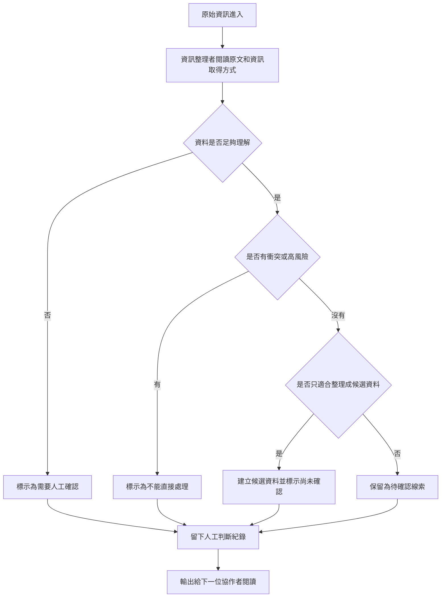

# 資訊流程設計

> 這份文件是 Release 02 的流程設計草稿。它不是程式碼，也不是正式救災流程。後續實作前，仍需要小組檢查與修改。

## 我的 v1 目標

- 我優先服務的使用者：資訊整理者。
- 這個使用者最想完成的事：把混亂的原始資訊整理成候選資料或待確認線索，讓下一位協作者知道哪些地方還不能相信。
- 我最想避免的錯誤：把還沒確認的資訊顯示成已確認，或讓它看起來可以直接變成救災任務。

## 自然語言流程描述

```text
原始資訊進來後，資訊整理者先看原文、資訊取得方式和目前查核狀態。

如果原文缺少時間、地點、來源、數量、當事人確認或重要脈絡，就標示為需要人工確認。

如果資訊可能涉及真實個資、安全風險、地點不明、來源互相衝突，或 AI 只是猜測，就不能直接處理，也不能變成任務。

如果資訊足夠整理，資訊整理者可以建立候選資料，但它仍然只能是候選，不是已確認事實。

AI 可以幫忙提醒缺漏、整理風險和提出草稿，但不能自己決定資訊是真的，也不能自己決定誰要去行動。

每次人工判斷都要留下紀錄，包含判斷內容、採用或不採用的理由，以及仍不確定的地方。
```

## Mermaid 流程圖

請用 VS Code 預覽，確認流程圖能正常顯示。



## 人工確認點

- 原始資訊是否缺少時間、地點、來源、數量或重要脈絡。
- 資訊取得方式和原文內容是否互相矛盾。
- AI 整理出的候選資料是否有補原文沒有說的內容。
- 這筆資訊能不能整理成候選資料，還是只能保留為待確認線索。

## 不能自動處理的分支

- 不能讓 AI 自動判斷一筆資訊是真的或假的。
- 不能讓 AI 自動決定救災、派工或行動優先順序。
- 不能把來源不同、時間不同的資訊自動合併成同一個現況。
- 不能把含糊地點、二手轉述、可能有個資或安全風險的內容直接變成任務。

## 操作或判斷紀錄

- 誰把一筆資訊標成需要人工確認。
- 誰決定一筆資訊不能直接處理。
- 誰建立候選資料，以及候選資料根據哪一段原文。
- AI 建議被採用或拒絕的理由。
- 目前仍不確定、需要下一位協作者確認的問題。

## 我檢查後修正了什麼

- 原本：流程可能讓「資訊足夠」的資料直接變成候選資料。
- 修正後：加上「是否有衝突或高風險」和「仍標示尚未確認」兩個檢查。
- 為什麼：就算資訊看起來完整，也可能有來源衝突、時間問題或安全風險。v1 不能把候選資料顯示成已確認事實。

## 我仍不確定的流程點

- 候選資料要整理到多詳細，才不會讓資訊整理者負擔太重。
- 「不能直接處理」和「需要人工確認」在畫面上要不要分成兩種很明顯的標籤。
- 下一位協作者看到候選資料時，會不會誤以為它已經可以行動。

## 我自己補充的判斷

我覺得這個流程最重要的是不要太快把原始資訊變成任務。因為有些資料看起來很多，但其實可能少了時間、地點或確認來源。

我也覺得「候選資料」和「已確認資料」一定要分清楚。候選資料只是可以先整理給下一位協作者看，不代表它是真的，也不代表可以馬上行動。

如果之後要做 v1 畫面，我希望畫面能很清楚地告訴使用者：哪些資訊只是待確認線索，哪些資訊不能直接處理，哪些判斷是 AI 建議但還需要人檢查。
